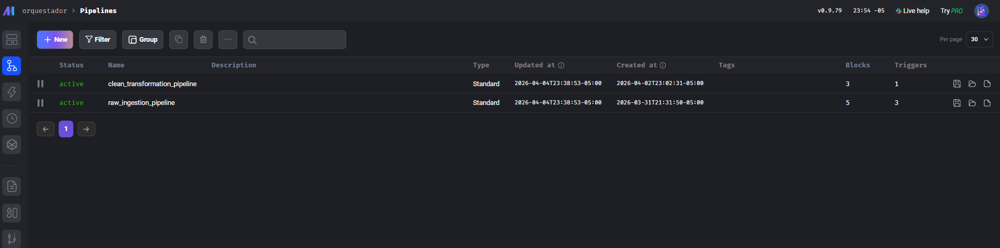
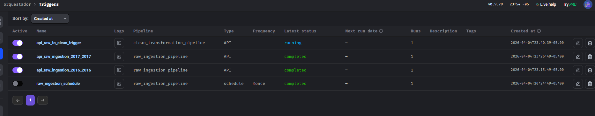

# Proceso ELT (Extract, Load, Transform)

El proyecto utiliza un enfoque **ELT**, donde los datos se cargan primero en un esquema de aterrizaje (`raw`) y luego se transforman dentro de la base de datos PostgreSQL al esquema analítico (`clean`).

## Pipeline 1: Ingesta de Datos (Raw)

Este pipeline es el responsable de extraer los datos desde la fuente externa y almacenarlos de forma inmutable.

### 1. Extracción (Extract)
- **Bloque**: `download_raw_data`.
- **Acción**: Descarga archivos Parquet desde el bucket de NYC TLC.
- **Periodo**: 2015 - 2017 (configurado para optimizar velocidad y espacio).
- **Orquestación**: Utiliza un bloque dinámico (`month_generator`) para procesar los meses en paralelo.

### 2. Carga (Load)
- **Bloque**: `load_to_postgres_raw`.
- **Acción**: Crea el esquema `raw` (si no existe) e inserta los datos en la tabla `yellow_taxi_trips`.
- **Transformaciones Técnicas**: Se aplican cambios mínimos como el renombrado de columnas a minúsculas y el tipado básico para optimizar el almacenamiento.

### Evidencia de Ingesta (Gráfico)

*Figura: Vista de la tabla yellow_taxi_trips dentro del esquema raw en pgAdmin.*

---

## Pipeline 2: Transformación (Clean)

Este pipeline se dispara automáticamente mediante un trigger personalizado al completar la ingesta de la capa Raw.

### 1. Limpieza y Validación (Transform)
Para asegurar la calidad de los datos en la capa analítica, se aplican los siguientes filtros en el bloque `build_fact_table`:

- **Distancia**: Registros con `trip_distance` entre 0 y 100 millas.
- **Costos**: Registros con `fare_amount` y `total_amount` entre $0 y $500.
- **Pasajeros**: Registros con `passenger_count` entre 1 y 6.
- **Fechas**: Validación de que `tpep_dropoff_datetime` es posterior a `tpep_pickup_datetime`.
- **Duración**: Viajes con una duración calculada entre 1 y 180 minutos.

### 2. Modelado Dimensional (Transform)
- **Dimensiones**: El bloque `build_dimensions` identifica valores únicos en `raw` y puebla las tablas `dim_*` usando claves subrogadas.
- **Hechos**: El bloque `build_fact_table` realiza joins entre la tabla cruda filtrada y las dimensiones para construir la tabla de hechos `fact_trips`.

### Evidencia de Transformación (Gráfico)

*Figura: Estructura de tablas y claves subrogadas en el esquema clean.*

---

## Automatización y Triggers

*Figura: Vista de los pipelines de Ingesta y Transformación en la interfaz de Mage.*

### Trigger de Ingesta
- Configurado para ejecutarse de forma secuencial por años.
- **Gráfico**: 
*Figura: Configuración de triggers dinámicos en Mage AI.*

### Trigger de Limpieza (Chained)
- Implementado en Python (`trigger_clean_pipeline.py`).
- Detecta el fin del ciclo de ingesta para disparar la transformación final.
